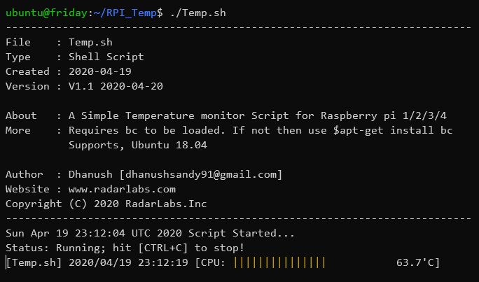

# Raspberry Pi Temperature Script

<!--

-->

A Simple Temperature monitor Script for Raspberry pi 1/2/3/4.
It supports Ubuntu and Debian.

# Commad

~$./RPI_Temp/Temp.sh

# Dependents

- Basic Calculator

~$sudo apt-get install bc

# Priview

# About

Author  : Dhanush

Email   : dhanushsandy91@gmail.com

Copyright (C) 2020 RadarLabs.Inc
